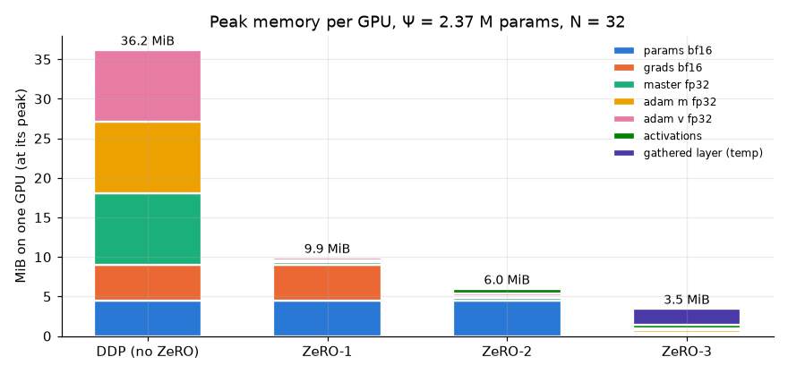
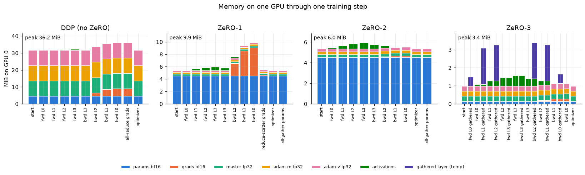
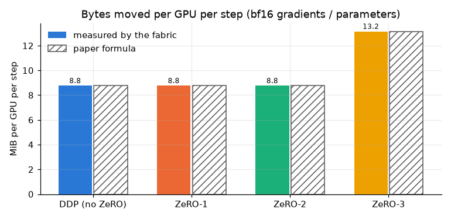
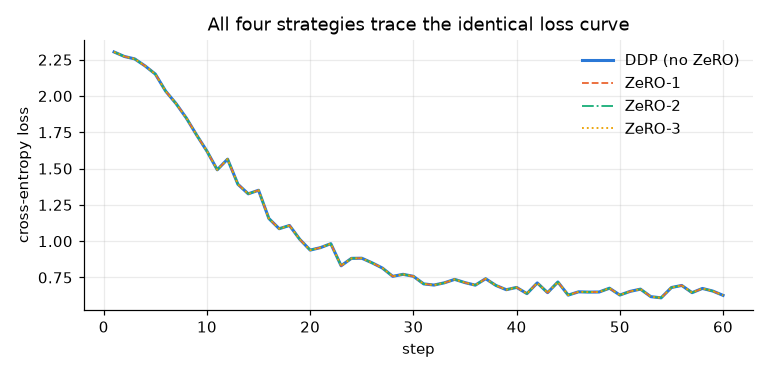
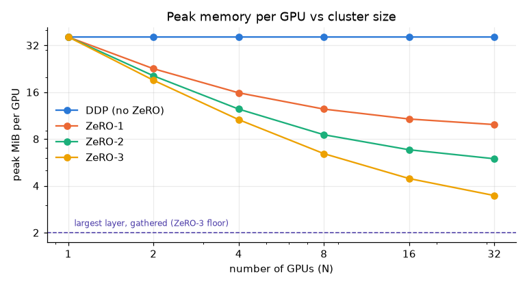

# ZeRO-1, ZeRO-2, ZeRO-3 on 32 virtual GPUs

**ERA V5 — Session 12 assignment.** Thirty-two virtual GPUs built from CPU
threads, one small model trained on them four ways — plain data parallelism,
then ZeRO stages 1, 2 and 3 — with the memory, the bytes on the wire, and the
work per GPU measured at every step.

* [`assignment.ipynb`](assignment.ipynb) — the executed notebook (runs unchanged on Colab, no setup)
* [`zero_sim.py`](zero_sim.py) — the simulator: virtual GPUs, the fabric, the hand-written model, the four strategies
* [`figures/`](figures/) — the plots below

```bash
python3 zero_sim.py        # trains all four stages, ~2 min on a laptop, prints the comparison
```

---

## The one-paragraph version

When you train with data parallelism on N GPUs, every GPU holds a *complete*
copy of the model, its gradients, and its optimizer state — with mixed
precision and Adam that is **16 bytes for every parameter, on every GPU**.
Only the activations are actually different from GPU to GPU. ZeRO
(*Zero Redundancy Optimizer*, Rajbhandari et al. 2020) notices that this
replication is pointless and removes it in three steps: shard the optimizer
state (**ZeRO-1**), then the gradients too (**ZeRO-2**), then the parameters
themselves (**ZeRO-3**). Each GPU owns 1/N of everything and borrows the rest
when it needs it. The first two stages are free in communication; the third
costs 1.5× the bytes. None of them change the arithmetic — I check that all
four end with bit-identical weights.

---

## 1. What I built

I wanted to *measure* ZeRO rather than draw it, so the simulator is built so
the memory numbers are real byte counts and the communication numbers are
real collective calls, while the hardware is faked.

| piece | what it is | real or pretend |
|---|---|---|
| `VirtualGPU` | an object with a rank and a private ledger. `hold(name, category, tensor)` puts a tensor on the GPU and charges the ledger; `drop(name)` frees it. Tracks the current bytes per category and the peak with a breakdown | memory is **real**: it's the bytes of the tensors the object is holding |
| worker threads | each virtual GPU's forward/backward/optimizer runs on its own thread, 32 at once | compute is real, wall-clock time is not meaningful (one Python GIL) |
| `Fabric` | performs `all_reduce`, `reduce_scatter`, `all_gather` for the 32 GPUs and bills each GPU the bytes a ring implementation moves | the arithmetic is done once in-process; the **byte accounting is real** |
| the model | a 4-layer MLP, 256→1024→1024→1024→10, Ψ = 2,372,618 parameters, **forward and backward written by hand** | real; no autograd, so I can see exactly when a weight is needed |
| mixed precision | bf16 params and grads; fp32 master weights and Adam *m*, *v* | real dtypes, real sizes |
| bf16 matmul | this CPU has no fast bf16 kernel, so `mm_bf16` multiplies in fp32 and rounds to bf16 | that is exactly what a tensor core does: bf16 in, fp32 accumulate, bf16 out |

Why hand-written backward? Because ZeRO-3 is a story about *when a weight
exists*. With autograd the weight is silently kept alive between forward and
backward. Writing `layer_backward` myself forced the question "where does `W`
come from right now?" — and the answer for ZeRO-3 is "it doesn't exist, gather
it again".

### Where 16 bytes per parameter comes from

| what | dtype | bytes | who reads it |
|---|---|---|---|
| working weight | bf16 | 2 | forward + backward |
| gradient | bf16 | 2 | optimizer |
| master weight | fp32 | 4 | optimizer only |
| Adam *m* | fp32 | 4 | optimizer only |
| Adam *v* | fp32 | 4 | optimizer only |
| | | **16** | |

The last three rows — 12 of the 16 bytes, the paper's *K = 12* — are read by
nothing but the optimizer. That is the whole opening for ZeRO-1.

### The three collectives

| collective | meaning | bytes per GPU (ring) |
|---|---|---|
| all-reduce | everyone puts in a full tensor, everyone gets the mean | 2·(N−1)/N · size |
| reduce-scatter | everyone puts in a full tensor, GPU *i* gets only chunk *i* of the mean | (N−1)/N · size |
| all-gather | GPU *i* puts in chunk *i*, everyone gets the full tensor | (N−1)/N · size |

The fact I leaned on most: **an all-reduce *is* a reduce-scatter followed by an
all-gather**. Same bytes. That is why the first two ZeRO stages are free.

## 2. The four strategies, as I implemented them

One training step in lockstep. Every GPU has its own micro-batch of 64 samples.

**DDP (stage 0).** Every GPU holds all 16Ψ bytes. Forward, backward, then
all-reduce every gradient so all GPUs have the mean; every GPU runs the full
Adam update on its full fp32 copy and refreshes its bf16 working weights.
32 GPUs do 32 identical optimizer steps.

**ZeRO-1 — shard the optimizer state.** Each GPU keeps only its 1/32 slice of
master, *m*, *v*. Forward and backward are unchanged (full bf16 weights, full
bf16 gradients appear). Then, instead of all-reduce: **reduce-scatter** the
gradients so GPU *i* receives just the mean of slice *i*; update my slice;
**all-gather** the updated bf16 slices so everyone has the new full weights.
Reduce-scatter + all-gather = the bytes of one all-reduce. Nothing extra on
the wire, and nobody ever needed the full averaged gradient.

**ZeRO-2 — shard the gradients too.** Same two collectives as ZeRO-1, but the
reduce-scatter runs *inside* backward: the moment layer *i*'s gradient is
computed, it is scattered and only my 1/32 slice is kept. The full gradient
never sits in memory. The difference between ZeRO-1 and ZeRO-2 is literally
*when* one call happens.

**ZeRO-3 — shard the parameters.** Each GPU holds only its 1/32 slice of the
bf16 weights. Before layer *i*'s forward, **all-gather** its weights into a
temporary, use them, free them. Backward needs them again, so **gather them a
second time**, compute the gradient, free them, reduce-scatter the gradient as
in ZeRO-2. After the optimizer updates my fp32 slice I refresh only my bf16
slice — no final all-gather, the next forward will gather on demand. Three
collectives per layer instead of two per step: +Ψ on the wire.

## 3. What the measurements show

### Memory per GPU



| strategy | peak per GPU | model states (measured) | paper formula | = | vs DDP |
|---|---|---|---|---|---|
| DDP | 36.20 MiB | 36.20 MiB | 16Ψ | 36.20 | 1× |
| ZeRO-1 | 9.90 MiB | 9.90 MiB | 4Ψ + 12Ψ/N | 9.90 | 3.7× |
| ZeRO-2 | 5.97 MiB | 5.52 MiB | 2Ψ + 14Ψ/N | 5.52 | 6.1× |
| ZeRO-3 | 3.46 MiB | 1.13 MiB | 16Ψ/N | 1.13 | 10.5× |

The measured model-state bytes match the paper's Figure 1 to two decimals —
which I take as evidence the simulation is doing what the paper describes, not
just something that looks like it.

Two things the paper's formula doesn't show, and the ledger does:

* **ZeRO-2's peak (5.97) is above its model-state number (5.52)** because
  the peak is now at the *end of forward*, where activations are largest.
  Once the gradients stop dominating, activations are the next thing you see.
* **ZeRO-3's peak (3.46) is 3× its model-state number (1.13).** The extra
  2.0 MiB is one 1024×1024 layer, gathered in full. ZeRO-3 shards the *storage*
  of a layer, but the layer still has to exist whole on every GPU while it is
  used. The floor of ZeRO-3 is the largest layer, not Ψ/N.

### Memory *during* a step — the mechanism



This is the plot that made the three stages click for me. GPU 0's ledger after
every phase of one step:

* **DDP and ZeRO-1** climb through backward as full gradients accumulate
  (+4.5 MiB), then fall when the optimizer frees them. ZeRO-1 is the same
  shape, 26 MiB lower — it dropped 31/32 of the fp32 states before the step
  even started.
* **ZeRO-2 goes *down* through backward.** Each layer's gradient is scattered
  the moment it exists, so memory falls layer by layer instead of rising.
* **ZeRO-3 is a sawtooth.** Each tooth is a layer being gathered and freed.
  There are teeth in backward as well — the second gather, which is where the
  extra bytes come from.

### Communication per GPU



| strategy | measured per step | paper | calls per step |
|---|---|---|---|
| DDP | 8.77 MiB | 2Ψ elements | 8 all-reduce |
| ZeRO-1 | 8.77 MiB | 2Ψ | 8 reduce-scatter + 8 all-gather |
| ZeRO-2 | 8.77 MiB | 2Ψ | 8 reduce-scatter + 8 all-gather |
| ZeRO-3 | 13.15 MiB | 3Ψ | 16 all-gather + 8 reduce-scatter |

(8 = the model's 8 parameter tensors; a real implementation buckets them.)
ZeRO-1 and ZeRO-2 cost exactly what DDP costs. ZeRO-3 costs 1.5×, entirely
from gathering every layer a second time in backward. It cannot keep the
gathered layer between forward and backward — that would be 2Ψ of memory
again, undoing the point.

### Computation per GPU

This one needs splitting into three, because they behave differently.

| | DDP | ZeRO-1/2/3 |
|---|---|---|
| forward + backward FLOPs per GPU | 0.911 GFLOP | **identical** |
| parameters the optimizer updates per GPU | 2,372,640 | **74,145** (÷32) |
| Adam step, one GPU alone, single thread | 9.1 ms | **0.14 ms** (63×) |
| synchronisation points per step | 8 | 16 / 16 / 24 |

* **The matmuls don't change.** Each GPU still pushes its own micro-batch
  through the full model. ZeRO changes who *stores* a weight, not who *uses*
  it. Same FLOPs, and the loss curves are the same line.
* **The optimizer gets at least N× cheaper per GPU** with any ZeRO stage,
  because it only updates what it owns — 32× fewer elements, and 63× less
  time measured, because a 300 KB shard fits in cache while the 9.5 MB full
  tensors do not. DDP's 32 GPUs each doing the same full Adam
  update was redundant compute, not just redundant memory.
* **ZeRO-3 adds synchronisation points**, not FLOPs. Every extra all-gather
  is a moment where the GPU waits for the fabric. Real systems hide this by
  prefetching layer *i+1* while computing layer *i*, which is why ZeRO-3
  needs a fast interconnect to keep up with ZeRO-2.

I do not report the simulation's wall-clock time as a compute measurement.
Thirty-two Python threads share one GIL, so the per-thread timings say more
about the interpreter than about the algorithm; the notebook prints them
labelled as such.

### Same weights, to the bit

```
ZeRO-1 vs DDP after 60 steps:  max |Δw| = 0.0
ZeRO-2 vs DDP after 60 steps:  max |Δw| = 0.0
ZeRO-3 vs DDP after 60 steps:  max |Δw| = 0.0
```



This is the check I care about most. ZeRO is not an approximation and not a
different optimizer. It is only a decision about *which GPU holds which
bytes*. The fabric sums gradients in fp32 in a fixed order, and Adam's update
is element-wise, so a shard of the update is the same numbers as that slice of
the full update.

### Scaling with N



Same model, N = 1, 2, 4, 8, 16, 32. DDP is flat: more GPUs, same memory each.
ZeRO-1/2/3 fall as 1/N. ZeRO-3 bends toward the dashed line — the
largest gathered layer — which is the floor it can never go below. (At N = 1
all four are the same thing: one GPU holding everything.)

## 4. What this means for a real model

Because the simulator reproduces the paper's formulas exactly, I can trust the
formulas at sizes I cannot run. Model states only, on 32 × 80 GB GPUs:

| model | DDP | ZeRO-1 | ZeRO-2 | ZeRO-3 |
|---|---|---|---|---|
| 1 B | 16 GB | 4.4 GB | 2.4 GB | 0.5 GB |
| 7 B | 112 GB ✗ | 30.6 GB | 17.1 GB | 3.5 GB |
| 13 B | 208 GB ✗ | 56.9 GB | 31.7 GB | 6.5 GB |
| 70 B | 1120 GB ✗ | 306 GB ✗ | 171 GB ✗ | 35 GB |
| 175 B | 2800 GB ✗ | 766 GB ✗ | 428 GB ✗ | 87.5 GB ✗ |

A 7B model doesn't fit under DDP at all, fits with room to spare under
ZeRO-1, and under ZeRO-3 is small enough that activations become the whole
problem. 70B needs ZeRO-3 on 32 GPUs; 175B needs more GPUs or something ZeRO
doesn't provide.

## 5. What I take away

1. **Data parallelism's waste is replication.** 32 GPUs, 32 identical copies
   of 16 bytes/param. Only the activations were ever different.
2. **ZeRO-1 removes the biggest chunk for free.** 12 of the 16 bytes are read
   only by the optimizer, and the optimizer is element-wise, so each GPU can
   own 1/N and update just that. The reduce-scatter + all-gather it needs are
   the two halves of the all-reduce DDP was already doing.
3. **ZeRO-2 is ZeRO-1 with better timing.** Scatter each gradient *as it is
   produced* and the full gradient never exists. Same bytes on the wire.
4. **ZeRO-3 is the first stage that costs something.** Sharding the weights
   means gathering every layer twice per step: memory drops to 16Ψ/N + one
   layer, communication rises 1.5×. Worth it when the model doesn't fit;
   otherwise ZeRO-2 is the sweet spot.
5. **Compute is untouched.** Same FLOPs, same loss, same weights bit for bit.
   The optimizer step even gets N× cheaper.
6. **Two things ZeRO does *not* shrink:** activations (same per-GPU work) and
   the largest single layer (must exist whole while in use). Those need
   activation checkpointing and tensor/pipeline parallelism — which is what
   ZeRO is usually combined with.

## Limitations, honestly

* The fabric does its arithmetic once and hands out copies; bandwidth and
  latency are not simulated, so I report bytes and call counts rather than
  seconds. A real ring all-reduce also has an N-dependent latency term I ignore.
* No bucketing, no prefetching, no overlap of communication with compute —
  the things DeepSpeed and FSDP spend most of their engineering on. This
  simulator shows the *floor* of each stage, not its tuned performance.
* One micro-batch per GPU per step; no gradient accumulation.
* Wall-clock time in the notebook is the Python interpreter juggling 32
  threads, not GPU time. I say so wherever it is printed.

## References

* Rajbhandari, Rasley, Ruwase, He. *ZeRO: Memory Optimizations Toward Training
  Trillion Parameter Models*, 2020. Figure 1 is the memory table; §7 the
  communication analysis. Every number in this README is checked against it.
